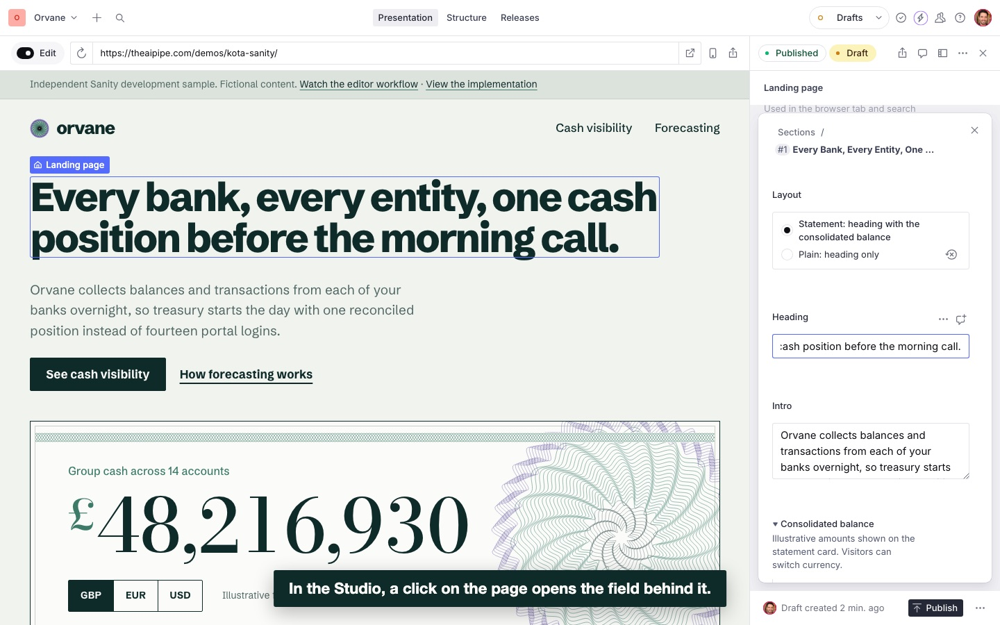

# Sanity page builder sample

An independent Sanity and Next.js sample built for a fictional B2B finance company, Orvane. Every name, figure and quote in it is invented.

**[Live site](https://theaipipe.com/demos/kota-sanity/)** · **[Editor workflow video, 80 s](https://theaipipe.com/demos/kota-sanity/workflow.mp4)**

[](https://theaipipe.com/demos/kota-sanity/workflow.mp4)

## What an editor can do

- Build a page from five approved section types: hero, feature grid, image and text, testimonials, call to action. Each has a readable preview in the list, sensible starting values and a few layout options (hero with or without the statement card, two or three columns, image left or right, ink or paper background).
- Reorder sections with the standard array controls in the Studio.
- Click any text on the page in Presentation to open the matching field, and watch the preview follow while typing. The public site keeps showing the published version until the editor presses Publish; no redeploy is involved.
- Get stopped, with a message that says how to fix it, when a change would break the page. Errors block publishing:
  - a button with a label but no destination, or a destination but no label;
  - a second hero, or a hero that is not at the top;
  - a feature grid with fewer than two or more than six items;
  - an image without alternative text;
  - a testimonial without its quote or its attribution, or the same testimonial twice in a section.
  Long headings and missing images are handled by the layout (a warning in the Studio, no broken page).

The video shows the owner account. On the Free plan there is no restricted editor role, so it is not a demonstration of client permissions.

## The change: an optional testimonials section

The four-section site was finished and committed first. The testimonials section was then added as a separate, reviewed change, staged on this sample (not on anyone's production code).

Request given to Claude Code, verbatim:

> Add an optional testimonials section to the existing page builder. Editors must be able to select and reorder testimonials. Require quote text and attribution. Keep the existing pages valid without this section and preserve their current content. Create the example content as drafts. Check the schema, query/types, frontend rendering and visual editing, including mobile.

- The change: [commit cda2dbf](../../commit/cda2dbf), schema, validation, GROQ projection, hand-written types, responsive component, Presentation locations.
- The review pass, by a separate Claude Code session: [commit 626af75](../../commit/626af75).
- Existing pages before and after: [`docs/review/before`](docs/review/before) and [`docs/review/after`](docs/review/after). Same page heights at 1440 and 390 px; the only pixel differences are the rosette ornament fixed during review.

## Content model and technical choices

- **Sections are inline objects** in one `pageBuilder` array, because their content belongs to one page. **Testimonials are documents**, referenced by the section, because the same quote is reused on several pages and corrected in one place.
- The landing page is a singleton; the two solution pages share one document type and one template.
- The schema in `studio/` is the source of truth. The Studio is hosted by Sanity; the front end is Next.js 16 (App Router) on Cloudflare Workers through OpenNext, served under a sub path.
- Visual editing follows the current next-sanity setup: `defineLive` with a Viewer token on the server, stega for click-to-edit, the maintained `defineEnableDraftMode` handler for the preview secret, `<VisualEditing />` only in Draft Mode. No write token exists in this repository or in browser code.
- Published pages are rendered per request from the Sanity CDN, so a publish shows up without a rebuild.
- The front end tolerates missing optional fields and content older than the code: unknown section types are skipped, buttons without a destination are not rendered, option values are compared after `stegaClean`.
- No AI runs on the site or in the Studio.

## Running it on your own Sanity project

```bash
# Studio
cd studio && npm install
cp .env.example .env          # SANITY_STUDIO_PROJECT_ID, SANITY_STUDIO_DATASET, SANITY_STUDIO_PREVIEW_ORIGIN, SANITY_STUDIO_PREVIEW_BASE_PATH
npx sanity login
npx sanity exec seed/seed.ts --with-user-token   # sample content, images from seed/images
npx sanity dev

# Front end
cd web && npm install
cp .env.example .env.local    # NEXT_PUBLIC_SANITY_PROJECT_ID, NEXT_PUBLIC_SANITY_DATASET, NEXT_PUBLIC_SANITY_STUDIO_URL, NEXT_PUBLIC_BASE_PATH, SANITY_API_READ_TOKEN
npx sanity cors add http://localhost:3000 --credentials   # from studio/
npm run dev
```

- `SANITY_API_READ_TOKEN` is a Viewer token (`npx sanity tokens add "preview" --role=viewer`).
- Checks: `npx tsc --noEmit` and `npx sanity build` in `studio/`, `npx tsc --noEmit` and `npx next build` in `web/`, `npx sanity documents validate` for content.
- `scripts/r9_presentation_check.py` drives the hosted Studio with Playwright and checks the four Presentation behaviours (click to field, live draft preview, public session unaffected, publish without redeploy). `scripts/page_snapshots.py` captures every page at 1440 and 390 px.
- Deploy: copy `web/wrangler.example.jsonc` to `wrangler.jsonc`, set your route, then `npm run deploy`.
- No starter was used; the code follows the Sanity and next-sanity documentation for Studio 6 and next-sanity 13.

## How the change was made with Claude Code

Claude Code ran headless in this repository on a subscription (no API key set), with the official Sanity plugin enabled (`.claude/settings.json`), the repository's `CLAUDE.md`, and Sanity's MCP server authenticated by a temporary Editor token kept outside the repository and deleted afterwards. Local tools wrote the code; MCP read the existing documents and created the example content as drafts.

Excerpt of the run (MCP operations with their stated intent, and the files written):

```text
MCP query_documents   "Inspect existing pages before adding a testimonials section"
MCP get_sanity_rules  page-builder, visual-editing
write studio/schemaTypes/documents/testimonial.ts
write studio/schemaTypes/sections/testimonials.ts
write studio/presentation/resolve.ts
write web/components/sections/Testimonials.tsx   (+ queries.ts, types.ts, Sections.tsx, globals.css)
CLI   npx sanity schema deploy                    so MCP sees the new types
MCP create_documents  "Example testimonials for the new testimonials page builder section, as drafts"
MCP patch_documents   "Add example testimonials sections to draft versions of two pages, keeping their existing sections"
MCP create_documents  "Temporary invalid drafts to prove the required-field validation, discarded right after"
CLI   npx sanity documents validate               rules fire with their messages
MCP discard_drafts    "Remove the temporary validation-check drafts"
local next build, next start, Playwright checks of drafts at 1440 and 390 px, published pages compared with docs/review/before
```

### Review note

Checked: the diff file by file, Studio validation on the drafts, draft rendering at 1440 and 390 px, the published pages before and after, and the four Presentation checks on the deployed site.

Corrected:
- The example quotes named companies that could exist. They now describe a sector instead of a company.
- The run noticed that the rosette ornament rendered as a black disc in the earlier snapshots. Cause: its first path lost its attributes after hydration. Fixed by rendering it on the server.
- `scripts/page_snapshots.py` waited for an idle network, which the live preview never reaches. It now waits for page load.

After review, the three testimonials and the landing page were published from the Studio.
